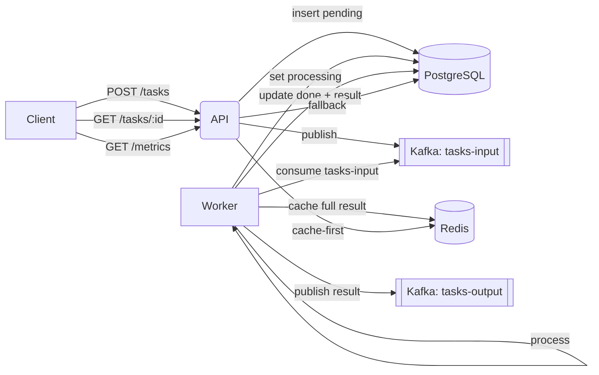

# Task Processor

A microservice that accepts tasks via REST, stores them in PostgreSQL, publishes to Kafka for processing, caches results in Redis, and exposes metrics.

## Architecture

- API (NestJS, TypeScript):
  - POST /tasks → insert task (pending) → publish to `tasks-input`
  - GET /tasks/:id → cache-first (Redis) → DB fallback → cache set
  - GET /metrics → total done tasks, average processing time
- Worker (Kafka consumer):
  - Consumes `tasks-input`, sets status to processing, reverses payload and appends length, updates DB (done + result), caches full result object, publishes to `tasks-output`
- PostgreSQL: tasks table
- Redis: cache key `task:result:{taskId}` with TTL 1h
- Kafka: topics `tasks-input`, `tasks-output`



## Stack

- Node 20, NestJS 11, TypeScript 5
- Drizzle ORM + `pg`
- PostgreSQL 16
- Redis 7
- Kafka 3.7 (KRaft mode)
- Docker Compose

## Quickstart (Docker)

```bash
# Start all services (API, worker, Postgres, Redis, Kafka, Adminer, RedisInsight, Kafka UI)
docker compose up -d --build

# Apply DB migrations (from schema)
docker compose run --rm api npm run drizzle:migrate

# Tail logs
docker compose logs -f api worker postgres redis kafka
```

Services (ports)

- API: http://localhost:3000
- Postgres: localhost:5432 (user: task, pass: task, db: taskdb)
- Redis: localhost:6379
- Adminer: http://localhost:8080 (System: PostgreSQL, Server: postgres)
- RedisInsight: http://localhost:5540
- Kafka broker: kafka:9092 (inside compose), 9092 exposed
- Kafka UI: http://localhost:8081

## Environment

The compose file provides these to containers:

- DATABASE_HOST=postgres, DATABASE_PORT=5432, DATABASE_USER=task, DATABASE_PASSWORD=task, DATABASE_NAME=taskdb
- REDIS_HOST=redis, REDIS_PORT=6379
- KAFKA_BROKERS=kafka:9092

For local (outside Docker), create `.env` accordingly (host=localhost).

## Database

Drizzle config: `drizzle.config.ts`, schema: `src/db/schema.ts`

Migrations:

```bash
docker compose run --rm api npm run drizzle:generate
docker compose run --rm api npm run drizzle:migrate
```

## API

- POST /tasks
  - Request
    ```json
    { "payload": "Hello world!", "priority": 1 }
    ```
  - Response
    ```json
    {
      "id": "<uuid>",
      "status": "pending",
      "createdAt": "2025-01-01T00:00:00.000Z"
    }
    ```

- GET /tasks/:id
  - Pending example
    ```json
    {
      "id": "<uuid>",
      "payload": "Hello world!",
      "priority": 1,
      "status": "pending",
      "result": null
    }
    ```
  - Done example (standardized object)
    ```json
    {
      "taskId": "<uuid>",
      "result": "!dlrow olleH (len=12)",
      "processedAt": "2025-01-01T00:00:02.345Z"
    }
    ```

- GET /metrics
  - Response
    ```json
    { "totalTasks": 5, "averageProcessingTimeMs": 1200 }
    ```

## Kafka

- Input topic: `tasks-input`
  - Message
    ```json
    { "taskId": "<uuid>", "payload": "Hello world!", "priority": 1 }
    ```
- Output topic: `tasks-output`
  - Message
    ```json
    {
      "taskId": "<uuid>",
      "result": "!dlrow olleH (len=12)",
      "processedAt": "2025-01-01T00:00:02.345Z"
    }
    ```

## Caching

- Key: `task:result:{taskId}`
- TTL: 3600 seconds (1 hour)
- GET /tasks/:id returns cache when available; otherwise reads DB and then sets cache

## Development

Scripts:

```bash
npm run start:dev          # API dev server
npm run worker:dev         # Worker dev process
npm run lint               # ESLint (fix on save is configured)
npm run drizzle:generate   # Generate migrations from schema
npm run drizzle:migrate    # Apply migrations
```

## Git workflow

- Branches: `feat/<scope>`, `fix/<scope>`, `chore/<scope>`, `docs/<scope>`
- Conventional Commits examples:
  - `feat(api): implement POST /tasks and GET /tasks/:id`
  - `feat(worker): kafka consumer processes tasks`
  - `chore(devops): add docker compose services`

## Notes

- Metrics are computed over tasks with status `done`.
- DB `result` stores only the processed string; Redis caches full result object.
